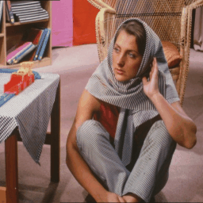
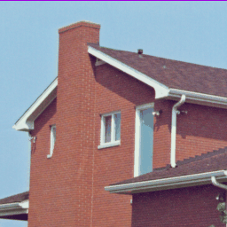
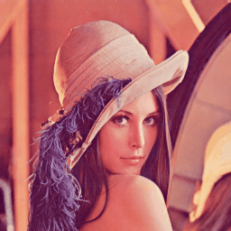
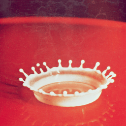

### Source codes for paper:

# Adaptable 2D to 3D (stereovision) image conversion based on deep convolutional neural network and fast inpaint algorithm

Author: [Tomasz Hachaj](https://home.agh.edu.pl/~thachaj/)

Converting 2D to 3D after the hiatus caused by the discontinuation of 3D TV production is gaining importance thanks to the high availability and popularity of virtual reality systems that use stereovision. In this paper, I propose and validate a number of depth image-based rendering (DIBR) approaches using state-of-the-art single-frame depth generation neural networks and inpaint (so called "holes filling") methods, including novel very fast inpaint (FAST), which significantly exceeds the speed of currently used algorithms of this type without degrading the quality of the resulting image. In addition, I propose to parameterize DIBR based on a single, easy-to-interpret adaptable parameter that can be adjusted online according to the preferences of the user who views the visualization. The proposed solutions were also compared with fully automatic 2D to 3D mapping solution. Algorithm proposed in this work with intuitive disparity steering, backbone deep neural network MiDaS and the FAST inpaint algorithm has been highly praised by observers as a method that generates steerable 3D on a variety of recordings well with qualitative (user) score that overcome state-of-the art fully automotive 2D to 3D conversion. What is more mean absolute error of the proposed solution does not contain statistically significant difference from state-of-the-art approaches like Deep3D and DIBR based on other depth estimation networks and other state-of-the-art inapiant functions. Since both the source codes and the generated videos are available for download all experiments can be reproduced as well as one can use the algorithm on any selected video or single image and apply it for example to be viewed in virtual reality glasses.

Keywords: Monocular stereo reconstruction, 2D to 3D, Stereoscopy, Depth, Disparity, Convolutional neural network, Depth image based rendering, DIBR

## Requirements

- hugginface-hub >= 0.14
- imageio-ffmpeg >= 0.48
- Keras >= 2.8, 
- numba >= 0.56, 
- numpy >= 1.23
- opencv-python >= 4.7
- Tensorflow >= 2.8, 
- torch >= 1.11, 

Requires CUDA compatible GPU. Setup for [Windows](https://www.youtube.com/watch?v=EmZZsy7Ym-4). 

2D to 3D conversion was tested on: 
- PC, Intel i7-9700 3GHz, 64 GB RAM, NVIDIA GeForce RTX 2060 GPU, Windows 10 OS,
- Laptop, Intel i7-11800H 2.3GHz, 32 GB RAM, NVIDIA GeForce RTX 3050 Ti Laptop GPU, Windows 11 OS.

Stereovision movies were tested on virtual reality Oculus Quest 2 hardware [CLICK!](https://www.oculus.com/experiences/quest/) using DeoVR QUEST application [CLICK!](https://www.oculus.com/experiences/quest/2382576078453818/).

## How to run

The program can be run with Torch backbone for networks MiDaS-S, MiDaS-H oraz MiDaS-L. Implementation is located in the folder [midas](/midas/).
- [/midas/midas_run.py](/midas/midas_run.py) is used to run live stream video (you must have a camera connected) or to process a video file (for example, in mp4 format). There are a number of options such as resolution setting, max disparity, stereo pair generation configuration for the resulting video (vertical or horizontal) and many others. Videos on which qualitative (user) studies were performed based on the pixabay collection can be downloaded from [CLICK!](https://drive.google.com/drive/folders/1xt5gVhP2kyXIWQe8xpC3nwCDejKFD0Zw?usp=sharing
)
- [/midas/midas_evaluation.py](/midas/midas_evaluation.py) evaluation of the method on KITTI dataset [CLICK!](https://www.cvlibs.net/datasets/kitti/eval_scene_flow.php?benchmark=stereo) 

The program can be run with Tensorflow/Keras backbone for networks DenseDepth and DenseDepth-Small. Implementation is located in the folder [densedepth](/densedepth/).
- [/densedepth/dense_depth_run.py](/densedepth/dense_depth_run.py) is used to run live stream video (you must have a camera connected)
- [/densedepth/dense_depth_evaluation.py](/densedepth/dense_depth_evaluation.py) evaluation of the method on KITTI dataset [CLICK!](https://www.cvlibs.net/datasets/kitti/eval_scene_flow.php?benchmark=stereo) 

The implementation that evaluate deep3d method on the KITTI and pixabay datasets can be found in the folder [deep3d](/deep3d/). In order to execute it download [Deep3D](https://github.com/HypoX64/Deep3D) and copy file [/deep3d/deep3d_evaluation.py](/deep3d/deep3d_evaluation.py) into Deep3D project folder.

In each script set the appropriate paths under which the downloaded data is locally located and output paths for the converted video!

Suggested configuration for mp4 video: DIBR + MiDaS + FAST inapint, max disparity = 75.

## Example resutls on benchmark images

Right image stereo pair is estimated from left image. Algorithm: DIBR + MiDaS + FAST inapint, max disparity = 25.

 
 
 

## Downloads

Download KITTI dataset for validation [CLICK!](https://www.cvlibs.net/datasets/kitti/eval_scene_flow.php?benchmark=stereo) 

Download videos for qualitative (user) study, both source (left) video and selected results [CLICK!](https://drive.google.com/drive/folders/1xt5gVhP2kyXIWQe8xpC3nwCDejKFD0Zw?usp=sharing
)

## Full text

To be added.

## Cite as
To be added.

## Source code references

I have used parts of source codes from:
- [Deep3D](https://github.com/HypoX64/Deep3D)
- [DenseDepth](https://github.com/ialhashim/DenseDepth)
- [MiDaS](https://github.com/isl-org/MiDaS)
- [tello_obstacles](https://github.com/browarsoftware/tello_obstacles)